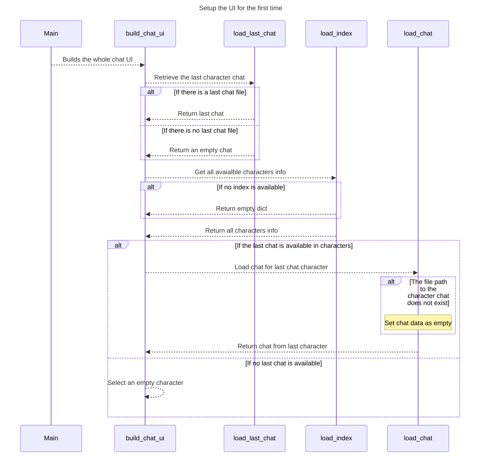

```mermaid
sequenceDiagram
    participant Main
    participant build_chat_ui
    participant load_last_chat
    participant load_index
    participant load_chat

    Title: Setup the UI for the first time

      Main-->>build_chat_ui: Builds the whole chat UI
      build_chat_ui-->>load_last_chat: Retrieve the last character chat
      alt If there is a last chat file
          load_last_chat-->>build_chat_ui: Return last chat
      else If there is no last chat file
          load_last_chat-->>build_chat_ui: Return an empty chat
      end
  
      build_chat_ui-->>load_index: Get all avaialble characters info
      alt If no index is available
          load_index-->>build_chat_ui: Return empty dict
      end
      load_index-->>build_chat_ui: Return all characters info
  
      alt If the last chat is available in characters
          build_chat_ui-->>load_chat: Load chat for last chat character
              alt The file path to the character chat does not exist
                  Note over load_chat: Set chat data as empty
              end
  
              load_chat-->>build_chat_ui: Return chat from last character
      else If no last chat is available
          build_chat_ui-->>build_chat_ui: Select an empty character
      end

    
``` 
