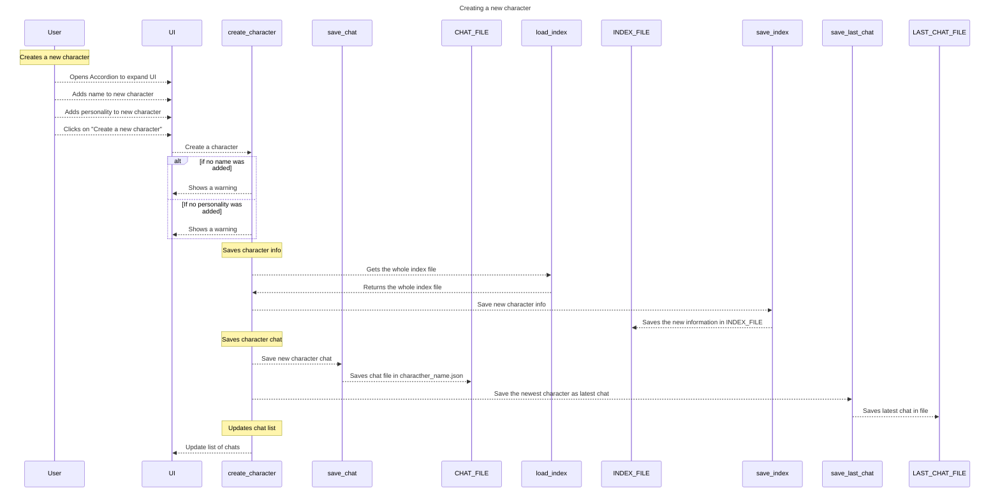

```mermaid
sequenceDiagram
    participant User
    participant UI
    participant create_character
    participant save_chat
    participant CHAT_FILE
    participant load_index
    participant INDEX_FILE
    participant save_index
    participant save_last_chat
    participant LAST_CHAT_FILE

    Title: Creating a new character

    Note over User: Creates a new character
    User-->>UI: Opens Accordion to expand UI
    User-->>UI: Adds name to new character
    User-->>UI: Adds personality to new character
    User-->>UI: Clicks on "Create a new character"
    UI-->>create_character: Create a character
    alt if no name was added
        create_character-->>UI: Shows a warning
    else If no personality was added
        create_character-->>UI: Shows a warning
    end

    Note over create_character: Saves character info
    create_character-->>load_index: Gets the whole index file
    load_index-->>create_character: Returns the whole index file
    create_character-->>save_index: Save new character info
    save_index-->>INDEX_FILE: Saves the new information in INDEX_FILE

    Note over create_character: Saves character chat
    create_character-->>save_chat: Save new character chat
    save_chat-->>CHAT_FILE: Saves chat file in characther_name.json
    create_character-->>save_last_chat: Save the newest character as latest chat
    save_last_chat-->>LAST_CHAT_FILE: Saves latest chat in file

    Note over create_character: Updates chat list
    create_character-->>UI: Update list of chats
```
