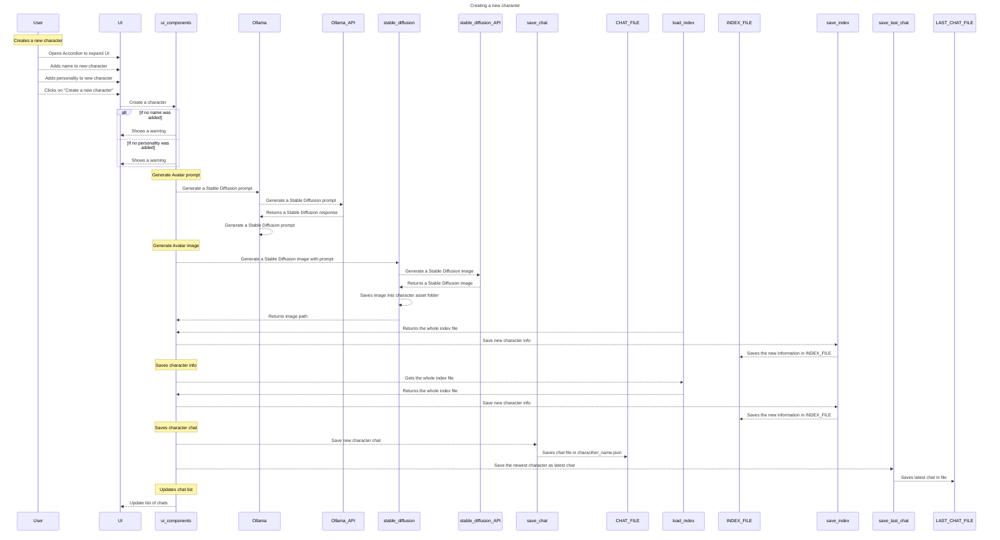

```mermaid
sequenceDiagram
    participant User
    participant UI
    participant ui_components
    participant Ollama
    participant Ollama_API
    participant stable_diffusion
    participant stable_diffusion_API
    participant save_chat
    participant CHAT_FILE
    participant load_index
    participant INDEX_FILE
    participant save_index
    participant save_last_chat
    participant LAST_CHAT_FILE

    Title: Creating a new character

    Note over User: Creates a new character
    User-->>UI: Opens Accordion to expand UI
    User-->>UI: Adds name to new character
    User-->>UI: Adds personality to new character
    User-->>UI: Clicks on "Create a new character"
    UI-->>ui_components: Create a character
    alt if no name was added
        ui_components-->>UI: Shows a warning
    else If no personality was added
        ui_components-->>UI: Shows a warning
    end

    Note over ui_components: Generate Avatar prompt
    ui_components-->>Ollama: Generate a Stable Diffusion prompt
    Ollama-->>Ollama_API: Generate a Stable Diffusion prompt
    Ollama_API-->>Ollama: Returns a Stable Diffusion response
    Ollama-->>Ollama: Generate a Stable Diffusion prompt

    Note over ui_components: Generate Avatar image
    ui_components-->>stable_diffusion: Generate a Stable Diffusion image with prompt
    stable_diffusion-->>stable_diffusion_API: Generate a Stable Diffusion image
    stable_diffusion_API-->>stable_diffusion: Returns a Stable Diffusion image
    stable_diffusion-->>stable_diffusion: Saves image into character asset folder
    stable_diffusion-->>ui_components: Returns image path

    load_index-->>ui_components: Returns the whole index file
    ui_components-->>save_index: Save new character info
    save_index-->>INDEX_FILE: Saves the new information in INDEX_FILE

    Note over ui_components: Saves character info
    ui_components-->>load_index: Gets the whole index file
    load_index-->>ui_components: Returns the whole index file
    ui_components-->>save_index: Save new character info
    save_index-->>INDEX_FILE: Saves the new information in INDEX_FILE

    Note over ui_components: Saves character chat
    ui_components-->>save_chat: Save new character chat
    save_chat-->>CHAT_FILE: Saves chat file in characther_name.json
    ui_components-->>save_last_chat: Save the newest character as latest chat
    save_last_chat-->>LAST_CHAT_FILE: Saves latest chat in file

    Note over ui_components: Updates chat list
    ui_components-->>UI: Update list of chats
```
