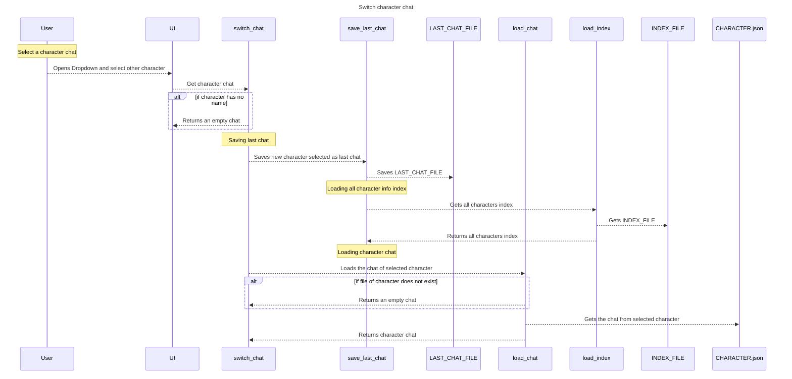

```mermaid
sequenceDiagram
    participant User
    participant UI
    participant switch_chat
    participant save_last_chat
    participant LAST_CHAT_FILE
    participant load_chat
    participant load_index
    participant INDEX_FILE
    participant CHARACTER.json

    Title: Switch character chat

    Note over User: Select a character chat
    User-->>UI: Opens Dropdown and select other character
    UI-->>switch_chat: Get character chat
    alt if character has no name
        switch_chat-->>UI: Returns an empty chat
    end

    Note over switch_chat: Saving last chat
    switch_chat-->>save_last_chat: Saves new character selected as last chat
    save_last_chat-->>LAST_CHAT_FILE: Saves LAST_CHAT_FILE

    Note over save_last_chat: Loading all character info index
    save_last_chat-->>load_index: Gets all characters index
    load_index-->>INDEX_FILE: Gets INDEX_FILE
    load_index-->>save_last_chat: Returns all characters index

    Note over save_last_chat: Loading character chat
    switch_chat-->>load_chat: Loads the chat of selected character
    alt if file of character does not exist
        load_chat-->>switch_chat: Returns an empty chat
    end

    load_chat-->>CHARACTER.json: Gets the chat from selected character
    load_chat-->>switch_chat: Returns character chat
```
