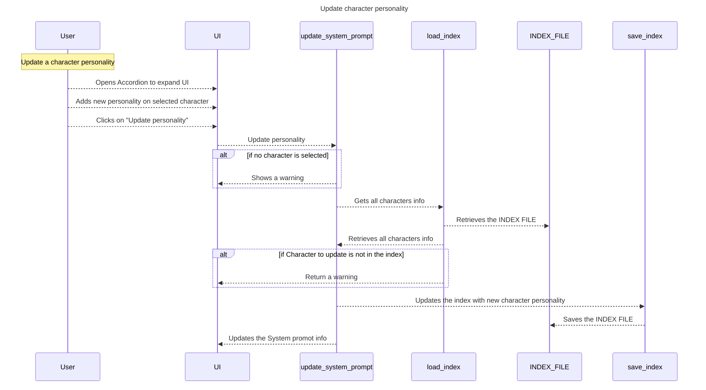

```mermaid
sequenceDiagram
    participant User
    participant UI
    participant update_system_prompt
    participant load_index
    participant INDEX_FILE
    participant save_index

    Title: Update character personality

    Note over User: Update a character personality
    User-->>UI: Opens Accordion to expand UI
    User-->>UI: Adds new personality on selected character
    User-->>UI: Clicks on "Update personality"
    UI-->>update_system_prompt: Update personality
    alt if no character is selected
        update_system_prompt-->>UI: Shows a warning
    end

    update_system_prompt-->>load_index: Gets all characters info
    load_index-->>INDEX_FILE: Retrieves the INDEX FILE
    load_index-->>update_system_prompt: Retrieves all characters info
    alt if Character to update is not in the index
        load_index-->>UI: Return a warning
    end

    update_system_prompt-->>save_index: Updates the index with new character personality
    save_index-->>INDEX_FILE: Saves the INDEX FILE
    update_system_prompt-->>UI: Updates the System promot info
```
